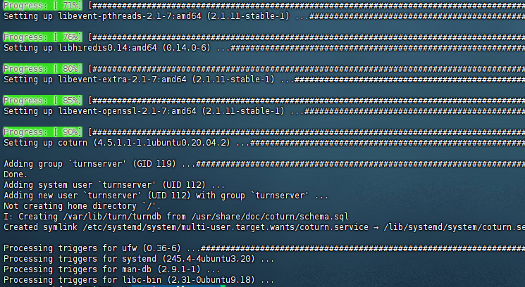
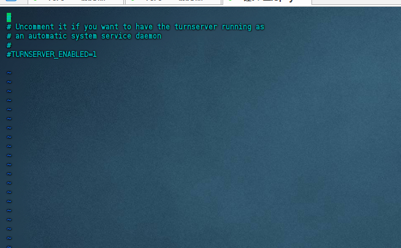
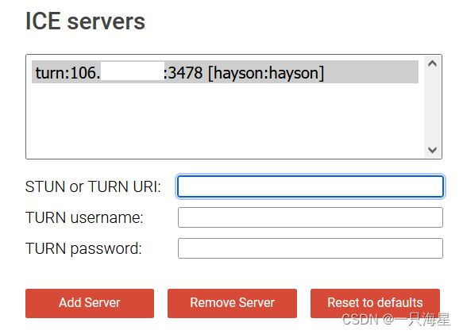
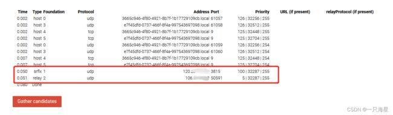

## ubuntu20环境下配置coturn

### coturn是什么

是什么：CoTURN 是一个功能完整的开源项目，它既实现了 STUN 协议（用于地址发现），也实现了 TURN 协议（用于中继媒体流），是一个全功能的 VoIP 媒体流量 NAT 穿透服务器和网关 。


为什么选择它：


功能完整：完全支持 STUN 和 TURN 的多个 RFC 标准，包括 TCP、TLS 和 DTLS 中继 。

易于安装：它被主流 Linux 发行版（如 Ubuntu、Debian、CentOS 等）的官方软件源收录，可以直接通过包管理器安装 。

生产就绪：可以用于生产环境，支持用户认证、多种数据库后端（如 SQLite, MySQL, Redis）等高级功能 。


简要安装思路：


在您的 Linux 服务器上，通常可以使用命令 sudo apt install coturn (Debian/Ubuntu) 或 sudo yum install coturn (CentOS/RHEL) 进行安装 。

安装后，需要编辑其配置文件（通常位于 /etc/turnserver.conf），设置监听端口（如 3478）、认证用户等信息，并启动服务 。

最后，将您自建的服务器地址（例如 stun.your-domain.com:3478）填入上述 LiveKit 的 stun_servers 配置中 


#### 配置过程

```shell
apt install coturn
```
然后看到类似于：

就表示安装成功

开机启动：
```shell
vim /etc/default/coturn
```
可以看到如下画面：

```shell
##取消注释
TURNSERVER_ENABLED=1
```
**核心配置详解**

Coturn 的配置文件位于 /etc/turnserver.conf。我们强烈建议在修改前备份原文件：
> sudo cp /etc/turnserver.conf /etc/turnserver.conf.bak


一个基础且安全的配置示例如下（请根据您的实际情况替换相应值）：

```shell
# 监听端口 (同时用于 STUN 和 TURN)
listening-port=3478

# 【重要】服务器的内网 IP 地址 (通过 ifconfig 或 ip addr 查看) 或者直接0.0.0.0
listening-ip=你的服务器内网IP 

# 【重要】服务器的公网 IP 地址
external-ip=你的服务器公网IP

# TURN 中继端口范围，需与防火墙放行规则一致
min-port=49152
max-port=65535

//增加安全选项，允许交换秘钥指纹，防止中间人攻击，非必需
/*
如果您取消注释以在TURN消息中使用指纹，这意味着客户端和服务器之间交换的消息将包括共享密钥的加密指纹。这个指纹用于确保消息的完整性和真实性，并防止中间人攻击。

默认情况下，此选项被关闭，这意味着客户端和服务器之间交换的消息将不包括指纹。然而，如果安全是一个问题，建议打开此选项，为通信添加额外的安全层。
*/
fingerprint

//打开鉴权，可以是证书或者用户名密码
/*
如果您取消注释以使用长期凭据机制，这意味着TURN服务器将使用凭据机制来验证客户端的身份。这个机制需要客户端提供一个凭据（如用户名和密码），以便TURN服务器可以验证客户端是否有权限使用服务。默认情况下，没有使用凭据机制，这意味着任何用户都可以使用TURN服务器。

如果您启用了凭据机制，则只有那些提供正确凭据的用户才能访问TURN服务器。这将增加通信的安全性和保护机密信息不被未经授权的访问。
*/
lt-cred-mech

# 创建测试用户 (格式为 username:password)
user=你的用户名:你的密码

# 域 (realm)，可以设置为你的服务器域名或公网 IP
realm=你的域名或公网IP ###必须填写，否则无法验证通过的!

# 安全与日志配置
fingerprint           # 在消息中加入指纹，增强安全性[citation:9]
no-loopback-peers     # 禁止与回环地址的对等体连接
no-multicast-peers    # 禁止与多播地址的对等体连接
syslog                # 使用系统日志

# 可选：TLS/DTLS 支持（如需更高安全性，需提前准备证书文件）
# tls-listening-port=5349
# cert=/etc/ssl/certs/your_cert.pem
# pkey=/etc/ssl/private/your_privkey.pem

```


**关键配置项说明：**


listening-ip 和 external-ip：这两个配置对处于 NAT 后的服务器至关重要。listening-ip 填内网 IP，external-ip 填公网 IP，CoTURN 才能正确通告其公网地址。


端口范围：min-port 和 max-port 定义的范围必须与云服务商控制台的防火墙规则（安全组）中开放的 UDP 端口范围完全一致。


## 启动、验证与集成
启动 Coturn 服务

```bash
sudo systemctl start coturn
sudo systemctl enable coturn
检查服务状态

bash
sudo systemctl status coturn
# 查看监听端口
sudo ss -lptun | grep -E '3478|49152'
```

### 使用 Trickle ICE 验证
这是最直观的验证方式。打开 Trickle ICE 测试页面。
>https://webrtc.github.io/samples/src/content/peerconnection/trickle-ice/

在 STUN Server 或 TURN Server 字段中，添加您的服务器地址，格式为 turn:你的公网IP:3478。

如果配置了用户名和密码，请在相应的字段中填写。

点击 "Add Server"，然后点击 "Gather candidates"。

在结果列表中，如果看到类型为 relay 的候选地址，则代表您的 TURN 服务已成功部署并生效。

### 调试：
在服务器需要测试某个端口是否可以访问，是否能够访问：
````shell

测试 某个端口 tcp是否可访问：
nc -zv 103.133.8.8 3478
103.133.8.8: inverse host lookup failed: h_errno 11004: NO_DATA
(UNKNOWN) [103.133.8.8] 3478 (?) open

测试某个端口 udp是否可访问：
nc -zuv 103.133.8.8 3478
103.133.8.8: inverse host lookup failed: h_errno 11004: NO_DATA
(UNKNOWN) [103.133.8.8] 3478 (?) open

````
3. 临时前台运行以查看详细错误
```shell

   bash
# 停止服务
sudo systemctl stop coturn

# 前台运行（调试模式）
sudo turnserver -c /etc/turnserver.conf --no-daemon -v -L 0.0.0.0
这时会看到实时日志，当您从 Trickle ICE 测试时，应该能看到详细的错误信息。

--对于旧版本的 coturn：
# 前台运行调试（不需要 --no-daemon）
sudo turnserver -c /etc/turnserver.conf -v -L 0.0.0.0

# 或更详细的调试
sudo turnserver -c /etc/turnserver.conf -V -L 0.0.0.0  # 大写V是超级详细模式
```

如果 trickle ice用udp协议怎么都不行，有可能是udp协议给运营商给劫持了，那么强制使用tcp：
例如：turn:103.133.8.8:3478?transport=tcp


### 与 LiveKit 集成
验证 Coturn 服务正常后，将其添加到 LiveKit 的配置文件 config.yaml 中：

```shell
rtc:
  # ... 其他配置
  turn_servers:
    - host: 你的公网IP或域名
      port: 3478
      protocol: udp  # 或 tcp
      username: 你的用户名
      credential: 你的密码

```

💡 高级建议
使用强密码和短期凭证：在生产环境中，建议启用 use-auth-secret 和 static-auth-secret，由应用服务端动态生成短期有效的临时用户名密码，避免在客户端代码中硬编码长期凭证。

启用 TLS：如果可能，为 TURN 服务配置 TLS（使用 tls-listening-port 和证书），可以加密中继流量并更容易穿透只开放 443 端口的严格网络环境。

内核调优：对于高并发的生产环境，可以参考专业文章对 Linux 内核参数（如 BBR 拥塞控制算法、Socket 缓冲区大小）进行调优，以提升转发性能和稳定性。


### 云服务器网络端口放行

>3478端口（TCP&&UDP) ps：你配置的端口，并且 tcp以及udp类型都要放开

>49152-65535端口（TCP&&UDP) ps：你配置的端口，并且 tcp以及udp类型都要放开
> 


### google ICE测试



remove server 先把默认的服务器清空

添加测试服务器

TURN URL:turn:106.66.66.66:3478
TURN username:hayson
TURN password:hayson

点击添加服务器
点击Gather candidates

这里我们看两个结果东西，srflx和relay
srflx：是表示反射地址，即我们自己的出口IP，如果用stun就只需要查看有反射就行了。
relay:表示中转地址。

host：收集的到浏览器电脑本机地址

### coturn --- 基于共享密钥的短期凭证
它的工作流程就像一个“令牌发放机”，需要一个安全的后端业务服务器来配合：

服务端预设“万能钥匙”（共享密钥）：首先，需要在 Coturn 的配置文件 /etc/turnserver.conf 中启用动态凭证功能并设置一个永久的、保密的共享密钥 (Shared Secret) 。

客户端向业务后端请求“临时令牌”：当一个客户端（如你的 App）想要使用 TURN 服务时，它首先向你的业务后端服务器发送请求。

后端生成“临时令牌”并返回：你的业务后端收到请求后，使用事先与 Coturn 约定好的共享密钥，按照特定规则生成一个临时用户名和密码，然后将这对凭证返回给客户端。这对凭证通常只有很短的有效期（例如 5-10 分钟）。

客户端使用“临时令牌”连接 Coturn：客户端拿到这对临时凭证后，就可以用它来向 Coturn 服务器发起连接请求。

Coturn 验证“临时令牌”：Coturn 收到请求后，使用同样的共享密钥，按照同样的规则对用户名和密码进行运算。如果运算结果匹配，且用户名中的时间戳没有过期，就验证通过，允许客户端使用 TURN 服务 。

#### ⚙️ 如何配置动态密码？
你需要修改 Coturn 的配置文件 (/etc/turnserver.conf) 并调整业务后端逻辑。

第一步：修改 Coturn 配置

注释掉静态用户：将你之前添加的 user=hayson:hayson 这行注释掉。

启用动态凭证：添加以下关键配置项：

```shell

# 启用基于共享密钥的动态凭证机制
use-auth-secret

# 设置一个非常复杂且保密的共享密钥
# 请务必替换成一个足够长的随机字符串，推荐使用 pwgen -s 64 1 生成
static-auth-secret=your-strong-random-secret-string-here

# 指定 Realm，通常使用你的域名或服务器IP
realm=103.133.8.8
```
use-auth-secret：打开动态密码的总开关 。

static-auth-secret：这是最关键的一步。你需要设置一个只有你的后端和 Coturn 知道的共享密钥。这个密钥必须足够长且随机，因为它就是整个安全体系的根基 。

#### 第二步：让你的业务后端生成临时凭证
你的后端服务器需要实现一个 API 接口（例如 /api/get_turn_credentials），供客户端调用。这个接口的逻辑如下：

生成临时用户名：用户名格式为 <过期时间戳>:<用户标识>。

过期时间戳：通常取当前时间的 Unix 时间戳（秒）加上一个有效期（例如 600 秒，即 10 分钟）。例如 1762168000。

用户标识：可以是用户的 ID 或其他唯一标识（可选）。

示例用户名：1762168000:user123

生成临时密码：使用 HMAC-SHA1 算法，以你在 Coturn 中设置的 static-auth-secret 为密钥，对上面生成的完整用户名字符串进行加密，然后将结果进行 Base64 编码 。

例如：
```java
import org.slf4j.Logger;
import org.slf4j.LoggerFactory;
import org.springframework.stereotype.Service;
import org.springframework.cache.annotation.Cacheable;

import javax.crypto.Mac;
import javax.crypto.spec.SecretKeySpec;
import java.time.Instant;
import java.util.Base64;
import java.util.concurrent.ConcurrentHashMap;

@Service
public class TurnCredentialService {
    
    private static final Logger logger = LoggerFactory.getLogger(TurnCredentialService.class);
    
    // Coturn 配置（应该从配置文件读取）
    private final String staticAuthSecret;
    private final String turnHost;
    private final int turnPort;
    
    // 可选：缓存最近生成的凭证，避免重复计算
    private final ConcurrentHashMap<String, CachedCredentials> credentialsCache;
    
    public TurnCredentialService() {
        // 实际应用中应该从 @Value 或配置类读取
        this.staticAuthSecret = "your-strong-random-secret-string-here";
        this.turnHost = "103.133.8.8";
        this.turnPort = 3478;
        this.credentialsCache = new ConcurrentHashMap<>();
    }
    
    /**
     * 获取 TURN 凭证（带缓存）
     */
    @Cacheable(value = "turnCredentials", key = "#userId", unless = "#result == null")
    public TurnCredentials getCredentials(String userId) {
        try {
            // 检查缓存
            String cacheKey = userId + "_" + (System.currentTimeMillis() / 300000); // 5分钟缓存
            if (credentialsCache.containsKey(cacheKey)) {
                CachedCredentials cached = credentialsCache.get(cacheKey);
                if (cached.getExpiryTime() > Instant.now().getEpochSecond()) {
                    logger.debug("Returning cached credentials for user: {}", userId);
                    return cached.getCredentials();
                }
            }
            
            // 生成新凭证
            int ttl = 600; // 10分钟
            TurnCredentials credentials = generateCredentials(userId, ttl);
            
            // 存入缓存
            credentialsCache.put(cacheKey, 
                new CachedCredentials(credentials, Instant.now().getEpochSecond() + ttl));
            
            logger.info("Generated TURN credentials for user: {}, expires in {}s", 
                       userId, ttl);
            
            return credentials;
            
        } catch (Exception e) {
            logger.error("Failed to generate TURN credentials for user: {}", userId, e);
            throw new RuntimeException("Unable to generate TURN credentials", e);
        }
    }
    
    /**
     * 生成 TURN 凭证的核心方法
     */
    private TurnCredentials generateCredentials(String userId, int ttl) {
        long expiry = Instant.now().getEpochSecond() + ttl;
        String username = expiry + ":" + userId;
        
        String password = hmacSha1Base64(staticAuthSecret, username);
        
        return new TurnCredentials(username, password, ttl, 
            String.format("turn:%s:%d?transport=%s", turnHost, turnPort, "tcp"));
    }
    
    /**
     * HMAC-SHA1 + Base64 编码
     */
    private String hmacSha1Base64(String secret, String data) {
        try {
            Mac mac = Mac.getInstance("HmacSHA1");
            SecretKeySpec keySpec = new SecretKeySpec(secret.getBytes("UTF-8"), "HmacSHA1");
            mac.init(keySpec);
            byte[] hmacBytes = mac.doFinal(data.getBytes("UTF-8"));
            return Base64.getEncoder().encodeToString(hmacBytes);
        } catch (Exception e) {
            throw new RuntimeException("HMAC-SHA1 calculation failed", e);
        }
    }
    
    /**
     * 凭证数据类
     */
    public static class TurnCredentials {
        private final String username;
        private final String password;
        private final int ttl;
        private final String uri;
        
        public TurnCredentials(String username, String password, int ttl, String uri) {
            this.username = username;
            this.password = password;
            this.ttl = ttl;
            this.uri = uri;
        }
        
        // Getters and toString...
        public String getUsername() { return username; }
        public String getPassword() { return password; }
        public int getTtl() { return ttl; }
        public String getUri() { return uri; }
    }
    
    /**
     * 缓存条目
     */
    private static class CachedCredentials {
        private final TurnCredentials credentials;
        private final long expiryTime;
        
        CachedCredentials(TurnCredentials credentials, long expiryTime) {
            this.credentials = credentials;
            this.expiryTime = expiryTime;
        }
        
        public TurnCredentials getCredentials() { return credentials; }
        public long getExpiryTime() { return expiryTime; }
    }
}

```